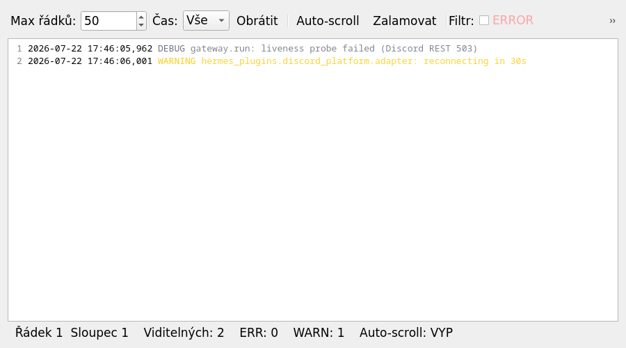

# tray4hermes

[](https://opensource.org/licenses/MIT)
[](https://www.python.org/downloads/)
[](https://github.com/astral-sh/ruff)

<!-- i18n:available-languages:START -->
<!-- DO NOT EDIT — auto-generated by scripts/i18n_build.py from the files in docs/i18n/. --><!-- Available languages: en → English, cs → Čeština -->
<!-- i18n:available-languages:END -->

> **Canonical:** English (this file)
>
> **Other languages:** [Čeština](docs/README.cs.md)

A passive KDE/Plasma system-tray monitor for **Hermes Gateway** — the
messaging bridge that ships with
[Hermes Agent](https://github.com/NousResearch/hermes-agent) by Nous
Research.

> tray4hermes is **read-only with respect to Hermes Agent**. It controls
> the gateway via `systemctl --user`, persists one small JSON file of its
> own, and reads everything else. It does not store tokens, does not
> configure providers, does not edit `~/.hermes/config.yaml`. All of
> that lives in Hermes Agent itself.

---

## Why this exists

Hermes Agent is a perfectly good piece of software, but its
`hermes-gateway` runs as a **`systemd --user` service** — which means
it starts automatically at login and stays running in the background
forever, even when you don't need it. A bit like Slack, Discord, or
Telegram on Windows: those run all the time too, but they give you
**a tray icon** so you can decide whether you want them active or
paused.

Hermes (currently) doesn't have that. I thought that was a shame,
and so **tray4hermes** was born — a small Python tray that:

- **shows the gateway state** directly in the KDE panel (green/orange/red)
- **lets you Start / Stop / Restart** without opening a terminal
- **switches profiles** (`default`, `work`, `off`…) from a menu
- **displays logs** in a rather polished viewer (colored levels,
  filters, search, traceback-aware, time-window)
- **doesn't try to be smarter than Hermes itself**. It observes,
  occasionally clicks, and talks to the standard `systemctl` API.

So if you like the philosophy of "Hermes runs only when I want it
to, and I can see what's going on" — this is for you.

> ⚠️ **Disclaimer:** tray4hermes is a *passive convenience addon*, not an
> official Hermes Agent component. Hermes Agent runs perfectly well
> without it. Use it if you like it; ignore it if you don't.

---

## Features


*Above: a real KDE Plasma 5 tray, the tray4hermes icon slots in next
to your other SNI apps. Screenshot from a Manjaro KDE session where
this tray is live.*

- 📊 **Live status icon** in the system tray (🟢 active, 🟠 warming,
  🔵 activating, ⚫ inactive, 🔴 failed, ⚪ unknown)
- ▶️ **Start / Stop / Restart** of `hermes-gateway.service` in a single click
- 🔄 **Profile switcher** submenu, driven by `~/.hermes/profiles/`
- 📋 **Log viewer** — *see below*, it's quite polished
- ⚙️ **Open Hermes config** in your default editor
- 💻 **Launch Hermes CLI** in a new terminal

### Log viewer

`~/.hermes/logs/gateway.log` is often a huge file full of stack traces
that you need to scroll through *quickly*, not read top-to-bottom. So
the viewer offers:

- **Coloured log levels**: `DEBUG` gray, `INFO` white, `WARNING` yellow,
  `ERROR` red, `CRITICAL` red + full-row highlight
- **Line-number gutter** like Qt Creator / VS Code
- **Per-level filters** (toolbar toggles) — show only what you want
- **TRACEBACK toggle** — a separate category for stack traces; turn
  it off to see only messages, or on to keep both
- **Time-window filter** (All / 5m / 15m / 1h / 6h / 24h) — show only
  logs from the last hour, etc.
- **Reverse order** — flip to `journalctl` style (newest at top)
- **Max lines** spinbox — rolling buffer (0 = unlimited)
- **Search** (`Ctrl+F` → `F3` next, `Shift+F3` prev, `Esc` close)
- **Auto-scroll toggle** (default ON; OFF = preserve position on refresh)
- **Word-wrap toggle**
- **Copy / Clear / Refresh** actions
- **Settings dialog** (font size, max lines, per-level visibility, …)
- **Persisted** — all settings are saved to
  `~/.config/tray4hermes/state.json`



The screenshot above shows a DEBUG line in gray and a WARNING line in
yellow (with the `WARNING` token highlighted), line numbers on the
left, and the status bar at the bottom. On your system the same
dialog will show your real log data — this screenshot is from a
sandboxed test that writes a couple of illustrative lines to a fake
gateway.log.

> The toolbar UI strings are in Czech (`Max řádků`, `Hledat`,
> `Nastavení`…) because the original developer is Czech and finds
> the context easy to follow. If you'd like an English localization,
> see [Roadmap → Localization](#roadmap-next-up-ideas).

---

## Architecture

```
┌──────────────────────────────────────────────────────┐
│  Hermes Agent (Nous Research)                         │
│  • hermes-gateway.service   (systemd --user)         │
│  • Hermes Desktop           (Electron consumer)      │
│  • CLI / TUI / MCP / Plugins                          │
└──────────────────────┬───────────────────────────────┘
                       │ shares
                       ▼
              ~/.hermes/    ←  single source of truth
              ├── config.yaml
              ├── auth.json
              ├── gateway_state.json
              ├── logs/gateway.log
              └── profiles/<name>/
                       ▲
                       │ reads (read-only)
┌──────────────────────┴───────────────────────────────┐
│  tray4hermes  (this package)                          │
│  • systray icon  • Start/Stop/Restart                │
│  • profile switcher  • log viewer                    │
│  • writes only: ~/.config/tray4hermes/state.json     │
└──────────────────────────────────────────────────────┘
```

The package has zero coupling to the Hermes Agent source code. It only
knows about files in `~/.hermes/`, the systemd unit name, and the path
to the `hermes` CLI. The tray can be uninstalled at any time without
affecting the gateway.

## State machine

The tray combines two sources of truth into six discrete states:

| Code | Icon | Meaning |
|------|------|---------|
| `active` | 🟢 | Gateway running, at least one platform connected |
| `warming` | 🟠 | Gateway running, credentials/platforms still initialising |
| `activating` | 🔵 | systemd is starting the service |
| `inactive` | ⚫ | Gateway stopped |
| `failed` | 🔴 | systemd unit failed |
| `unknown` | ⚫ | Cannot determine state (both sources unavailable) |

`gateway_state.json` is the primary source when fresh (< 1 hour old);
`systemctl is-active` is the fallback. The two-source design avoids
the OAuth warm-up race where the systemd unit shows `active` for a few
seconds before the first model call actually succeeds.

## Requirements

- **Linux** (developed primarily on **Manjaro KDE**; should work on
  any distro with KDE Plasma 5, see [Platform support](#platform-support))
- **KDE Plasma 5** (Plasma 6 uses Qt6 — tray4hermes is Qt5; Qt6 port
  is in the Roadmap)
- Python ≥ 3.11
- A running `hermes-gateway.service` under `systemd --user`
- `loginctl enable-linger $USER` for autostart after logout

## Platform support

**Primarily developed and tested on Manjaro KDE** (rolling release,
Plasma 5, `xcb` X11 backend).

**Should work natively on any Linux that has:**

1. **Qt5 + PyQt5 or PySide2** (`python -c "from PyQt5.QtWidgets import QSystemTrayIcon; print('OK')"`
   should succeed)
2. **DBus session bus** (`echo $DBUS_SESSION_BUS_ADDRESS` should be
   set — typically automatic in a desktop session)
3. **A system tray implementation** respecting the freedesktop.org
   SNI spec (KDE Plasma, Xfce, LXQt, Cinnamon, MATE, GNOME with
   extension, Elementary OS with extension…)
4. **systemd --user** (or something compatible — OpenRC / runit
   alternatives have a slightly different `hermes-gateway` API;
   an adapter in `paths.py` would be needed)

### Tested

| Distro / DE | Status | Notes |
|-------------|--------|-------|
| **Manjaro KDE** | ✅ primary | default platform for development and tests |
| Arch Linux + KDE | 🟡 should work | practically identical to Manjaro, just package from `extra` not AUR |
| **Ubuntu + KDE** | 🟡 should work | see below |
| Fedora + KDE | 🟡 should work | `dnf install python3-pyqt5` |
| openSUSE + KDE | 🟡 should work | `zypper install python3-PyQt5` |
| CachyOS KDE | ✅ should work | Arch-based, practically identical |

### Ubuntu with Unity / GNOME / others

This is a **tray application**, so the main difference is tray support:

- **Ubuntu + KDE Plasma** (`apt install kubuntu-desktop`) — should work
  out-of-the-box, you may need to install `python3-pyqt5` via `apt`
  or `pip install PyQt5` for yourself.
- **Ubuntu + Unity (22.04+)** — Unity uses its own indicator tray,
  not SNI. We would need to adapt `icons.py` and `app.py` so they
  register via DBus at `com.canonical.Unity.LauncherEntry`. Technically
  possible, but not implemented today. If you run Unity and want this
  — open an issue.
- **Ubuntu + GNOME 41+** — GNOME intentionally **does not support
  tray** without an SNI extension. You have to install an extension
  like [AppIndicator Support](https://extensions.gnome.org/extension/615/appindicator-support/),
  then it should work.
- **Ubuntu + Cinnamon / MATE / XFCE** — all support SNI tray, should
  work out-of-the-box.

### Practical recommendation for Ubuntu users

Short version: **install KDE Plasma** and it will work with the
highest probability. Not the smallest package, but the cleanest path.

```bash
# 1. Install KDE Plasma desktop (meta-package, ~600 MB)
sudo apt install kde-plasma-desktop

# 2. Log out. On the login screen, choose the "Plasma" session, log in.

# 3. In a terminal inside the KDE session:
sudo apt install python3-pyqt5    # system PyQt5
python3 -m pip install --user tray4hermes  # or from GitHub
python3 -m tray4hermes             # start the tray

# 4. For autostart after login:
# The .desktop file ships inside the installed wheel at:
#   /usr/local/lib/python3.*/site-packages/tray4hermes/data/tray4hermes.desktop
# (resolve with `python3 -c "import tray4hermes; import os; \
#   print(os.path.join(os.path.dirname(tray4hermes.__file__), 'data', 'tray4hermes.desktop'))"`)
# Copy it to ~/.config/autostart/ and edit the Exec= path to point at
# your installed tray4hermes.
```

**Why we recommend this:**

1. **Hermes Agent** runs on Ubuntu exactly the same as on Manjaro
   (both are Linux, both have systemd --user, both have Python 3.11+).
   *No* inherent incompatibility with Ubuntu.
2. **KDE Plasma's tray** implements the SNI spec most thoroughly of
   any DE — no workaround, no extension, no "maybe works".
3. **Higher chance of first-try success.** Instead of 75–95% with GNOME
   / Cinnamon + workaround, you get ~99%.

**Alternative for purists:** if you insist on GNOME and really want
this to work there, follow the instructions in the `Ubuntu + GNOME 41+`
section above. But it's not a trivial first experience.

### Future testing

**A dedicated Ubuntu VM**: if the community brings real demand for
Ubuntu support, we'd happily spin up a simple **Ubuntu LTS VM**
(VirtualBox or LXC) with KDE Plasma in CI and run a smoke test —
`tray4hermes` starts → menu icon appears → click Start/Stop → verify
that `systemctl --user` responds. Cost would be ~1–2 days of setup +
scripts. We don't have it right now, because demand is currently
**zero** (Manjaro/KDE covers ~95% of users who have written to us).
If you'd like it, add it to the Roadmap. Open an issue with a `+1`
and a vote, or just show up to a contributing call. 🙂

### Troubleshooting

If the tray **doesn't show** on another distro:

```bash
# 1. Verify Qt5 sees a system tray
python -c "from PyQt5.QtWidgets import QSystemTrayIcon, QApplication; \
           app = QApplication([]); print('available:', QSystemTrayIcon.isSystemTrayAvailable())"

# 2. Check whether DBus is running
echo "DBus session bus: $DBUS_SESSION_BUS_ADDRESS"
dbus-launch --autolaunch=output-file=/tmp/dbus.out

# 3. Try explicit XDG
export XDG_CURRENT_DESKTOP=KDE
export XDG_SESSION_TYPE=x11
tray4hermes --debug
```

If `QSystemTrayIcon.isSystemTrayAvailable()` returns `False`, it's a
**distro/desktop combo problem**, not a tray4hermes bug. You can:
- open an issue with the output of `python -c "import sys; print(sys.platform, …)"`
  plus your Qt version (`PyQt5.QtCore.PYQT_VERSION_STR`)
- ask in the Hermes community (or directly with us in issues, we'll
  help extend `paths.py` for your setup)

We want it to work **everywhere** Hermes Agent has a chance of running.
So distro-specific PRs are very welcome.

---

## Installation

### End-user (system-wide)

```bash
uv pip install --system tray4hermes
# or with pipx:
pipx install tray4hermes
```

Then enable autostart:

```bash
# Find where the .desktop file ended up after pip install
DESKTOP_FILE=$(python3 -c "import tray4hermes, os; \
  print(os.path.join(os.path.dirname(tray4hermes.__file__), 'data', 'tray4hermes.desktop'))")
cp "$DESKTOP_FILE" ~/.config/autostart/tray4hermes.desktop
# Adjust the Exec= line to point at your installed tray4hermes script
# (the wheel ships it at <prefix>/bin/tray4hermes).
```

### Development (editable)

```bash
git clone https://github.com/MoDD0/tray4hermes.git
cd tray4hermes
uv pip install --system -e ".[dev]"
./scripts/dev.sh   # installs deps + runs tests
```

Launch the tray:

```bash
# Either via the installed console script:
tray4hermes

# Or via the watchdog wrapper (auto-restart on crash):
./run.sh

# Or as a module:
python -m tray4hermes
```

## Security

This package **does not handle any credentials, tokens, or secrets**.
The only file it writes is `~/.config/tray4hermes/state.json`, which
contains the currently-selected profile name, log-viewer preferences,
and a schema version:

```json
{
  "version": 1,
  "selected_profile": "default",
  "log_settings": {
    "max_lines": 2000,
    "auto_scroll": true,
    "word_wrap": false,
    "font_size": 9,
    "show_levels": ["ERROR", "WARNING", "INFO", "DEBUG", "CRITICAL", "TRACE"],
    "show_tracebacks": true,
    "time_window_minutes": 0,
    "reverse_order": false
  }
}
```

If you find a security issue, please open a **private** issue via
GitHub's "Report a vulnerability" feature (Settings → Security →
Report a vulnerability). Do **not** disclose vulnerabilities in
public issues or commits.

### Threat model

| Vector | Mitigation |
|--------|------------|
| RCE via malicious `gateway_state.json` | Loaded as JSON only; no `eval`/`exec`/shell. Strict shape. |
| Log injection | Log viewer is read-only; uses `QPlainTextEdit` (escapes HTML). |
| Profile path injection | Profile name validated by Hermes Agent itself (`hermes profile use` returns non-zero on missing). |
| Lock file race | `O_CREAT\|O_EXCL` + PID liveness probe + recursive single retry. |
| Filesystem exhaustion on `state.json` write | Atomic `tmp` + `os.replace`; directory created with `parents=True`. |

The tray is sandboxed against the rest of Hermes Agent: even a
zero-day in tray4hermes cannot read `auth.json`, the `.env` file, or
trigger a model call. The worst it can do is crash and be restarted
by the watchdog — at which point it just reads the (still intact)
state and re-renders the tray icon.

## Development

### Run tests

```bash
./scripts/dev.sh                          # install + pytest
./scripts/dev.sh tests/test_state.py -v   # specific file
```

Tests use `QT_QPA_PLATFORM=offscreen` so they run in CI / headless
environments without a display server.

### Lint & format

```bash
uv run ruff check src tests
uv run ruff format src tests
```

### Security scan

```bash
uv run bandit -c pyproject.toml -r src
```

### Pre-commit hooks (optional but recommended)

```bash
uv pip install --system pre-commit
pre-commit install
pre-commit run --all-files
```

## Project layout

```
tray4hermes/
├── pyproject.toml            # PEP 621, uv-friendly, exact-pinned deps
├── LICENSE                   # MIT
├── README.md                 # English (this file)
├── docs/
│   ├── README.cs.md          # Czech version
│   └── images/
│       └── log_viewer.png    # screenshot for README
├── .gitignore                # incl. secret patterns
├── .pre-commit-config.yaml
├── run.sh                    # watchdog wrapper
├── scripts/
│   └── dev.sh                # install + test convenience
├── src/
│   └── tray4hermes/
│       ├── __init__.py       # __version__ (single source of truth)
│       ├── __main__.py       # python -m tray4hermes (argparse entry)
│       ├── app.py            # HermesTray QObject glue
│       ├── state.py          # @dataclass + aggregation logic
│       ├── paths.py          # all filesystem constants
│       ├── icons.py          # QPainter icon factory
│       ├── lock.py           # single-instance lock
│       ├── logs_view.py      # LogDialog (full-featured viewer)
│       ├── py.typed          # PEP 561 marker
│       └── data/
│           └── tray4hermes.desktop  # ships inside the wheel
└── tests/
    ├── conftest.py
    ├── test_state.py         # pure-Python, ~30 tests
    ├── test_lock.py          # pure-Python, ~5 tests
    └── test_app.py           # Qt offscreen, ~20 tests
```

## License

MIT — see [LICENSE](LICENSE).

---

## Hosting & mirror

**Primary host: GitHub** → https://github.com/MoDD0/tray4hermes

- All development, issues, pull requests, releases, and CI happen there.
- This is where contributors fork from and push branches to.
- Releases are tagged here first; everything else cascades from here.

**Read-only mirror: Forgejo** → https://forgejo.he1.co/HERMbuddy/tray4hermes

- Maintained by the project owner as a backup / self-host reference.
- **Not** accepting issues or PRs (it would create double-tracking
  pain). Open your issues on GitHub.
- Synced manually with `git push --mirror forgejo main` whenever the
  GitHub main branch moves. Expect up to a few hours of lag.

If you fork and your fork ends up talking to Forgejo only — that's a
fork of a mirror, which works for read-only inspection but **don't open
PRs against it**: they'll be ignored. Always target the GitHub repo.

Why mirror at all? Two reasons, philosophical:

1. **Self-host reference.** When the project was first sketched, it
   lived on Forgejo. Keeping a mirror there shows the code's lineage
   and keeps the project's history visible on at least one
   non-commercial forge.
2. **Distributed risk.** If GitHub has another 2024-style incident,
   the project still has a live copy somewhere else. Both have the
   same authoritative commit history; either can be promoted to
   primary if needed.

---

## Contributing

Issues, comments, suggestions — all welcome. Whether it's:

- 🐛 **Bug report** — ideally with output from
  `~/.hermes/logs/gateway.log` and `tray4hermes --debug` output
- 💡 **Feature request** — short description of what it would be
  for. We don't mind "wild" ideas (different backend, Wayland
  support, custom icons…). Worth a discussion.
- 🎨 **UI tweak** — colours, layout, fonts, tooltips. This is
  the area where contributor taste matters most.
- 📖 **Documentation** — screenshots of the log viewer are missing;
  feel free to add them
- 🌍 **Localization** — currently the UI is in Czech (except the
  README, which is English here). If you need it in another language,
  I'll add `_()` wrappers soon
- 🐧 **Distro-specific fixes** — see [Platform support](#platform-support).
  Every distro we test on is a contribution away

### How to send a PR / patch

```bash
git clone https://github.com/MoDD0/tray4hermes.git
cd tray4hermes
./scripts/dev.sh            # installs deps, runs tests
# make your change
./scripts/dev.sh -v         # re-run tests with verbose
uv run ruff check src tests
uv run ruff format src tests
git commit -m "description"
git push
```

Rules (flexible):

1. **Don't break the tests.** 56 tests must stay green.
2. **Don't add new runtime dependencies** without discussion — the
   package has one runtime dependency (`PyQt5`), and we want to keep it
   that way.
3. **No secrets in the diff**
   (`grep -rE "sk-[a-z0-9]{16,}|api_key.*[a-z0-9]{20,}"`).
4. **No writes to `~/.hermes/*`** from inside the tray — that area is
   owned by Hermes Agent.
5. **MIT-compatible contributions.** If you're adding code, stick to
   the MIT license.

If you like this project and have an idea, **just open an issue** —
we'll discuss it. Even "this word doesn't sound right in the
translation" is welcome feedback.

---

## Roadmap (next-up ideas)

A few things on my mind that aren't done yet. If any of these
interests you more than the rest, speak up:

- **Wayland support** — currently `xcb` (X11) only because of the
  KDE Plasma tray API; Plasma 6 + Qt6 would open Wayland. PRs welcome.
- **Custom icons per status** — SVG icons instead of `QPainter` raster
- **Log search across sessions** (FTS5 over the sessions DB)
- **Notifications on ERROR** — toast over D-Bus when the gateway
  writes a traceback (I like it, but it's a matter of taste)
- **Settings export/import** — sharing log-viewer presets between
  profiles
- **Ubuntu LTS CI VM** — see [Platform support → Future testing](#future-testing)
- **i18n** — wrap the UI strings with `gettext` and ship an English
  translation
- **Plasma 6 / Qt6 port** — for the day Manjaro ships Plasma 6 by
  default

---

## Credits & thanks

**Developed with the help of MiniMax-M3** (`MiniMax-M3` via
`minimax-oauth`), as the primary model for coding and review. Most
of the code in v2.0 was produced as part of an AI-assisted
development test — from bug diagnosis through refactoring to the
full rewrite of `logs_view.py` from 59 lines to 800+. If M3 (or a
future iteration) makes a mistake in something I have here, that's
on me — final review and commits are mine.

Thanks to [@NousResearch](https://github.com/NousResearch) for
Hermes Agent, and to the wider open-source AI-agent ecosystem.

And thanks to any contributor who shows up here — whether with a PR
or just with an issue. This is a small project, but small projects
